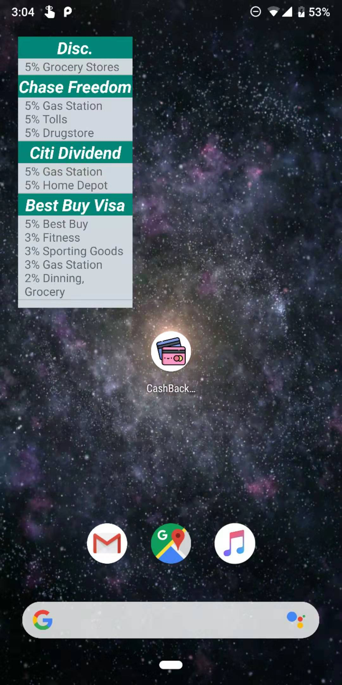
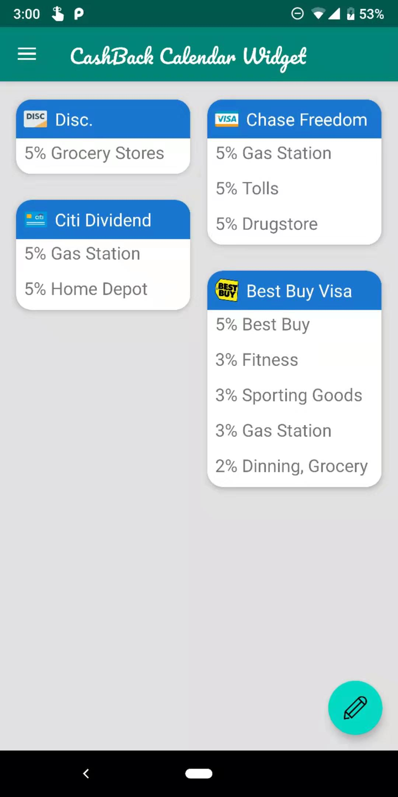

# Cash-Back-Calendar-Widget
an Android widget that pins the cash back calendars from various banks on your wall paper.

## How to modify the data source when creating updates?
1. Modify `CashbackDataSource.kt`
2. Modify `view_cards_selection.xml`
3. Modify `SharedPreferenceService`
4. Modify `fab.setOnClickListener` in `MainActivity.kt`
5. Modify `setCardCashbacks(curCard.cashbacks[ {currentQuarter} ])` in `CardRecyclerViewAdapter.kt`
 

  
  &nbsp &nbsp
  

